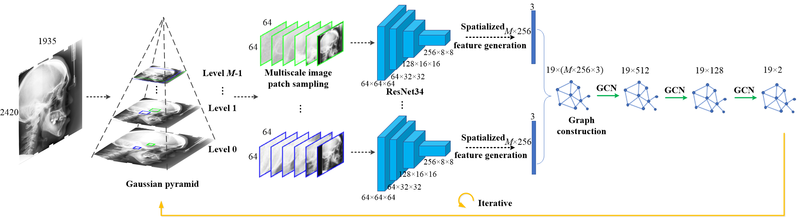

This is the code for our J-BHI paper "Landmark localization for cephalometric analysis using multiscale image patch-based graph convolutional networks". Only coarse stage code is now publicly available. For more details, please refer




### Inference command:

```python graph_final_test.py```

```
@article{lu2022,
title={Landmark Localization for Cephalometric Analysis using Multiscale Image Patch-based Graph Convolutional Networks},
author={Gang Lu, Yuanxiu Zhang, Youyong Kong, Chen Zhang, Jean-Louis Coatrieux, Life Fellow, IEEE and Huazhong Shu, Senior Member, IEEE},
journal={IEEE Jounal of Biomedical and Health Informatics},
year={2022},
publisher={IEEE}
}
```
